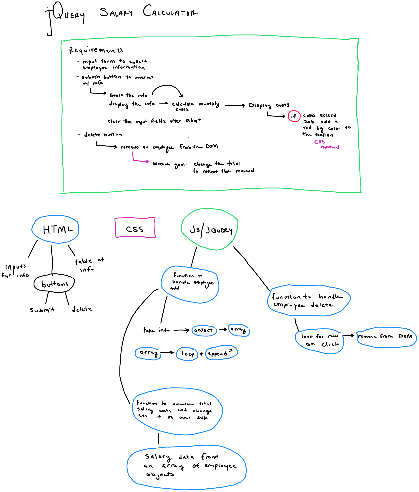
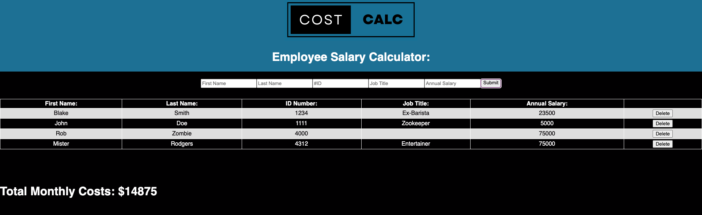
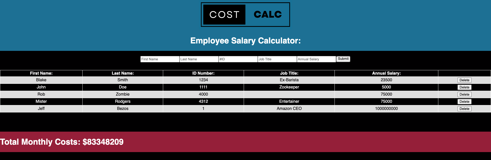

# Employee Salary & Monthly Cost Calculator:

## Description & Approach

_Duration: Weekend Solo Project_

The purpose of this project was to create a series of JavaScript functions meant to handle employee data and calculate the monthly costs said business. 

Using jQuery the goal was to append a pre-existing table using the information gathered from user input. We were also asked to change CSS depending on the costs vs. the budget.

Given that the instructions included a multitude of requirements I mapped out my path towards dealing with the issues:

## Screen Shots

## Topics Covered
- JavaScript
- jQuery - Selectors, append, and event handling

## Assignment

The application should have an input form that collects _employee first name, last name, ID number, job title, annual salary_.

A 'Submit' button should collect the form information, store the information to calculate monthly costs, append information to the DOM and clear the input fields. Using the stored information, calculate monthly costs and append this to the to DOM. If the total monthly cost exceeds $20,000, add a red background color to the total monthly cost.

Create a delete button that removes an employee from the DOM. For Base mode, it does **not** need to remove that Employee's salary from the reported total.

## Stretch Mode

Add styling or extra functionality that fits with the theme of this assignment.

Once the employee is deleted, update the _Total Monthly Cost_ section on the page to reflect the employee's removal. _HINT:_ You will need to figure out which employee was removed, in order to subtract their salary from the total. Consider using `.text()` as a getter, or look into jQuery's `.data()` function. This is tricky!

### Prerequisites

- [jQuery](https://jquery.com)

## Usage

1. Enter employee data in the provided inputs.
2. Submit employee information using the 'submit' button
3. Verify your inputs match the data displayed in the provided table.
4. Verify monthly costs do not exceed budget of 20,000.
5. Delete employees as needed using the provided 'delete' key in each table row.

## Built With

- VS Code
- HTML 5
- CSS
- JavaScript
- jQuery

## Acknowledgement
Thanks to [Prime Digital Academy](www.primeacademy.io) who equipped and helped me to make this application a reality. 
